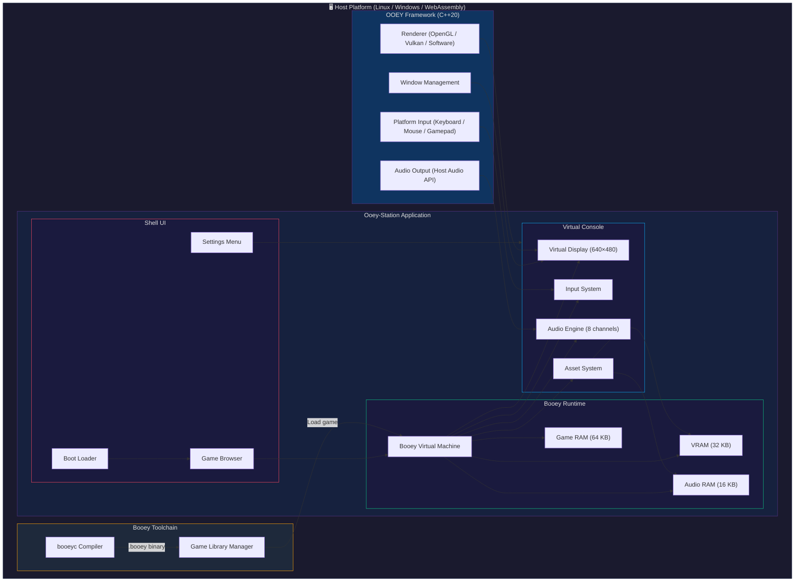
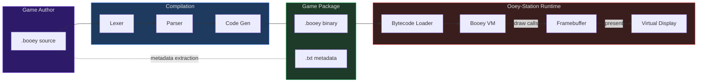
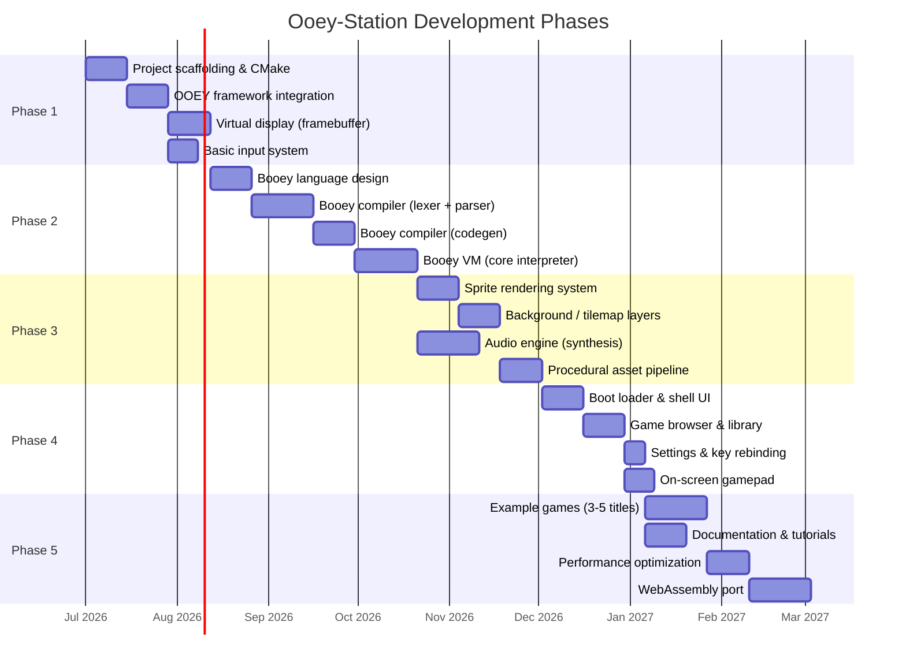

# 🎮 Ooey-Station: Project Overview

> **A retro-inspired 2D game console platform built on the OOEY C++20 UI framework,
> designed for humans and LLMs to create games with the Booey scripting language.**

---

## Table of Contents

1. [Project Vision & Philosophy](#1-project-vision--philosophy)
2. [System Architecture Overview](#2-system-architecture-overview)
3. [Technical Stack](#3-technical-stack)
4. [Console Specifications](#4-console-specifications)
5. [Document Index](#5-document-index)
6. [Development Phases](#6-development-phases)

---

## 1. Project Vision & Philosophy

### What is Ooey-Station?

Ooey-Station is a **virtual 2D game console** — a software platform that emulates the constraints and charm of classic 16-bit era hardware while providing modern tooling and an LLM-friendly scripting language called **Booey**. It runs on top of the **OOEY** C++20 UI framework, which handles cross-platform windowing, rendering, and input.

Think of it as a fantasy console in the spirit of PICO-8 or TIC-80, but with:

- **A dedicated scripting language** (Booey) designed from the ground up for clarity and LLM generation
- **A bytecode VM** that enforces console constraints at runtime
- **A polished shell UI** (boot screen, game browser, settings) that feels like powering on real hardware
- **Procedural asset generation** so games can be fully self-contained in a single script

### Why?

The core motivation is to create **an accessible game development platform where LLMs can reliably write complete, playable games**.

Modern game engines are sprawling, stateful, and depend on binary assets — all of which make them hostile to LLM-based generation. Ooey-Station solves this by:

| Problem with existing engines | Ooey-Station's answer |
|---|---|
| Complex APIs with thousands of entry points | Minimal, well-documented Booey API (~50 functions) |
| Binary assets (PNG, WAV, FBX) required | Procedural asset definitions in code |
| Stateful editor workflows | Pure text → compile → run pipeline |
| Unbounded complexity | Fixed console constraints (resolution, sprite count, memory) |
| Hard to verify correctness | Deterministic VM with clear error reporting |

### The End-to-End Flow

```
┌─────────────┐      ┌──────────────┐      ┌───────────────┐      ┌──────────────┐
│  Write game  │ ──▶  │   Compile    │ ──▶  │  Load in      │ ──▶  │  Play game!  │
│  in Booey    │      │  booeyc      │      │  Ooey-Station │      │              │
│  (.booey)    │      │  → .booey    │      │  shell        │      │  🎮          │
└─────────────┘      └──────────────┘      └───────────────┘      └──────────────┘
     ✏️ Text            ⚙️ Binary             📺 Console             🕹️ Gameplay
```

1. **Write** a game in the Booey scripting language (a `.booey` source file)
2. **Compile** it with `booeyc` into a `.booey` compiled bytecode binary
3. **Load** the binary in Ooey-Station through the game browser shell
4. **Play** the game with keyboard controls or the on-screen gamepad

### Inspiration

Ooey-Station draws direct inspiration from the golden age of 2D gaming:

| Console | What we borrow |
|---|---|
| **Super Nintendo (SNES)** | Background layer system, Mode 7-style effects, 256-color palettes |
| **Sega Genesis / Mega Drive** | Sprite limits, tile-based rendering, FM audio synthesis |
| **Game Boy Advance (GBA)** | Fixed resolution mindset, hardware sprite rotation/scaling |
| **Neo Geo** | Generous sprite counts, rich color depth |
| **PICO-8 / TIC-80** | Fantasy console philosophy, self-contained games, creative constraints |

The guiding principle: **constraints breed creativity**. By limiting resolution, sprite counts, colors, and audio channels to sane retro-inspired values, we make game development approachable while producing games with genuine character and charm.

---

## 2. System Architecture Overview

### High-Level Architecture



### Data Flow: From Script to Screen



### Subsystem Responsibilities

| Subsystem | Responsibility | Key Interfaces |
|---|---|---|
| **OOEY Framework** | Cross-platform windowing, rendering, input, and audio output | `OoeyWindow`, `OoeyRenderer`, `OoeyInput` |
| **Shell UI** | Boot animation, game selection, system settings | `BootLoader`, `GameBrowser`, `SettingsMenu` |
| **Virtual Display** | 640×480 framebuffer compositing (sprites + backgrounds + UI) | `VirtualDisplay::present()`, `VirtualDisplay::clear()` |
| **Input System** | Maps keyboard/gamepad to virtual controller; manages on-screen gamepad | `InputSystem::poll()`, `InputState` struct |
| **Booey VM** | Executes compiled bytecode; enforces memory/resource limits | `BooeyVM::execute()`, `BooeyVM::loadProgram()` |
| **Audio Engine** | Procedural waveform synthesis and mixing across 8 channels | `AudioEngine::playNote()`, `AudioEngine::playSfx()` |
| **Asset System** | Manages sprites, tilemaps, and sound definitions from Booey code | `AssetManager::defineSprite()`, `AssetManager::defineTile()` |
| **Booey Compiler** | Translates `.booey` source into bytecode binary | `booeyc` CLI tool |
| **Game Library** | Discovers, validates, and organizes installed games | `GameLibrary::scan()`, `GameEntry` struct |

---

## 3. Technical Stack

### Languages & Frameworks

| Layer | Technology | Details |
|---|---|---|
| **Host Application** | C++20 | Core console runtime, VM, rendering pipeline |
| **UI Framework** | OOEY | Custom C++20 framework for windowing, rendering, and input |
| **Game Scripting** | Booey Language | Purpose-built scripting language for game logic |
| **Build System** | CMake (3.20+) | Cross-platform build configuration |
| **Rendering Backend** | OpenGL 3.3+ / Vulkan 1.0+ / Software | Selectable at compile time via OOEY |
| **Audio Backend** | Host API (PulseAudio, WASAPI, WebAudio) | Platform-abstracted through OOEY |

### File Formats

| Extension | Format | Purpose |
|---|---|---|
| `.booey` (source) | UTF-8 text | Booey language source code |
| `.booey` (compiled) | Custom binary | Compiled bytecode + embedded assets |
| `.txt` | Plain text | Game metadata (title, author, description) |

> [!NOTE]
> Source and compiled `.booey` files share the same extension but are distinguished by a magic number header (`0x424F4F45` — "BOOE") in compiled binaries. The compiler and runtime both validate this.

### Platform Support

| Platform | Windowing | Renderer | Audio | Status |
|---|---|---|---|---|
| **Linux (X11)** | X11 via OOEY | OpenGL / Software | PulseAudio / ALSA | Primary target |
| **Linux (Wayland)** | Wayland via OOEY | OpenGL / Vulkan | PulseAudio / PipeWire | Primary target |
| **Windows** | Win32 via OOEY | OpenGL / Vulkan / Software | WASAPI | Planned |
| **WebAssembly** | Emscripten Canvas | WebGL | WebAudio | Stretch goal |

---

## 4. Console Specifications

The Ooey-Station virtual console defines fixed hardware-like specifications that all games must operate within. These constraints are enforced by the Booey VM at runtime.

### Spec Sheet

```
╔══════════════════════════════════════════════════════════════════╗
║                    OOEY-STATION SPECIFICATIONS                  ║
╠══════════════════════════════════════════════════════════════════╣
║                                                                  ║
║  DISPLAY                                                         ║
║  ├─ Resolution ............ 640 × 480 pixels                     ║
║  ├─ Aspect Ratio .......... 4:3                                  ║
║  ├─ Color Depth ........... 24-bit RGB                           ║
║  ├─ Active Palette ........ 256 colors per scene                 ║
║  └─ Framerate ............. 60 FPS (16.67ms per frame)           ║
║                                                                  ║
║  SPRITES                                                         ║
║  ├─ Max Simultaneous ...... 128                                  ║
║  ├─ Max Size .............. 64 × 64 pixels                       ║
║  ├─ Min Size .............. 8 × 8 pixels                         ║
║  ├─ Transforms ............ Flip H/V, 90° rotation, scaling     ║
║  └─ Transparency .......... 1-bit (color key) or 8-bit alpha    ║
║                                                                  ║
║  BACKGROUNDS                                                     ║
║  ├─ Layers ................ 4 scrollable layers                  ║
║  ├─ Tile Sizes ............ 8×8 or 16×16 pixels                 ║
║  ├─ Unique Tiles .......... Up to 1024 per layer                 ║
║  ├─ Map Size .............. Up to 256×256 tiles per layer        ║
║  └─ Scrolling ............. Per-pixel, independent X/Y per layer ║
║                                                                  ║
║  AUDIO                                                           ║
║  ├─ Channels .............. 8 simultaneous                       ║
║  ├─ Sample Rate ........... 44,100 Hz                            ║
║  ├─ Waveforms ............. Square, Triangle, Sawtooth, Sine     ║
║  ├─ Noise ................. White noise, periodic noise          ║
║  ├─ Synthesis ............. FM synthesis (2-operator)             ║
║  └─ Effects ............... Volume envelope (ADSR), vibrato      ║
║                                                                  ║
║  INPUT                                                           ║
║  ├─ D-Pad ................. Up, Down, Left, Right                ║
║  ├─ Face Buttons .......... A, B, C (primary row)                ║
║  ├─ Shoulder Buttons ...... X, Y, Z (secondary row)             ║
║  ├─ System Buttons ........ Start, Select                        ║
║  └─ Input Methods ......... Keyboard mapping, on-screen gamepad  ║
║                                                                  ║
║  MEMORY                                                          ║
║  ├─ Game RAM .............. 64 KB  (general purpose)             ║
║  ├─ Video RAM ............. 32 KB  (sprite/tile data)            ║
║  └─ Audio RAM ............. 16 KB  (instrument/sample data)      ║
║                                                                  ║
╚══════════════════════════════════════════════════════════════════╝
```

### Specification Comparison

For context, here is how Ooey-Station compares to the classic consoles that inspired it:

| Spec | SNES | Genesis | GBA | Ooey-Station |
|---|---|---|---|---|
| **Resolution** | 256×224 | 320×224 | 240×160 | **640×480** |
| **Colors on screen** | 256 | 64 | 512 | **256** |
| **Total palette** | 32,768 | 512 | 32,768 | **16.7M (24-bit)** |
| **Sprites on screen** | 128 | 80 | 128 | **128** |
| **Max sprite size** | 64×64 | 32×32 | 64×64 | **64×64** |
| **BG layers** | 4 | 2 | 4 | **4** |
| **Audio channels** | 8 (SPC700) | 10 (YM2612+PSG) | 6 (DMA) | **8** |
| **CPU** | 65C816 @3.58 MHz | 68000 @7.67 MHz | ARM7 @16.78 MHz | **Booey VM** |
| **Work RAM** | 128 KB | 64 KB | 32 KB | **64 KB** |

### Default Keyboard Mapping

| Console Button | Keyboard Key | Alternate |
|---|---|---|
| **D-Pad Up** | `W` | `↑` Arrow |
| **D-Pad Down** | `S` | `↓` Arrow |
| **D-Pad Left** | `A` | `←` Arrow |
| **D-Pad Right** | `D` | `→` Arrow |
| **A** | `J` | `Z` |
| **B** | `K` | `X` |
| **C** | `L` | `C` |
| **X** | `U` | `A` (when not D-Pad) |
| **Y** | `I` | `S` (when not D-Pad) |
| **Z** | `O` | `D` (when not D-Pad) |
| **Start** | `Enter` | — |
| **Select** | `Right Shift` | `Backspace` |

> [!TIP]
> The keyboard mapping is fully rebindable through the Settings menu. The defaults are designed for comfortable two-handed play on a standard QWERTY keyboard with the left hand on WASD and the right hand on JKL.

---

## 5. Document Index

This overview is the first in a series of detailed design documents. Each document dives deep into a specific subsystem.

| # | Document | Description | Key Topics |
|---|---|---|---|
| **00** | **Ooey-Station Overview** *(this document)* | Master reference and project introduction | Vision, architecture, specs, roadmap |
| **01** | Project Setup & Build System | Repository structure, CMake configuration, build instructions | Directory layout, dependencies, build targets, CI/CD |
| **02** | OOEY Framework Extensions | Modifications and extensions to the OOEY framework for Ooey-Station | Custom widgets, rendering hooks, platform abstraction |
| **03** | Virtual Display & Rendering Pipeline | Framebuffer architecture, sprite compositing, background layers | Layer compositing, palette management, scanline rendering |
| **04** | Input System & Gamepad | Virtual controller abstraction, keyboard mapping, on-screen gamepad | Input polling, button state, rebinding, touch/on-screen overlay |
| **05** | Boot Loader & Game Browser | Shell UI for system startup, game selection, and settings | Boot animation, game card UI, library scanning, settings persistence |
| **06** | Booey VM & Bytecode Specification | Virtual machine architecture and instruction set | Opcode table, register file, memory model, execution cycle |
| **07** | Booey Scripting Language Reference | Complete language specification for Booey | Syntax, types, control flow, built-in functions, API reference |
| **08** | Booey Compiler Implementation | Compiler architecture from source to bytecode | Lexer, parser, AST, semantic analysis, code generation |
| **09** | Asset System (Sprites, Tilemaps, Sound) | Procedural asset definition and management | Sprite sheets, tile definitions, sound instruments, asset encoding |
| **10** | Game Development Guide & Examples | Tutorial and reference for game authors | "Hello World" game, platformer tutorial, API cookbook, best practices |
| **11** | Sonic-Style Platformer Guide | Deep-dive into building a complete multi-level high-speed platformer | Physics, state machine, tile collision, cameras, rings, levels, gap analysis |

> [!IMPORTANT]
> Documents are numbered for reading order, but each is designed to be self-contained. Cross-references between documents use the format `→ See [Doc ##: Section Name]`.

---

## 6. Development Phases

The implementation follows a phased approach, where each phase builds on the previous and produces a testable, demonstrable milestone.

### Phase Overview



### Phase 1: Foundation 🏗️

**Goal:** Get a window on screen with a working framebuffer and basic input.

| Milestone | Deliverable | Depends On |
|---|---|---|
| **1.1** Project scaffolding | CMake builds, directory structure, CI green | — |
| **1.2** OOEY integration | OOEY compiles as submodule, window opens | 1.1 |
| **1.3** Virtual display | 640×480 framebuffer renders to OOEY window | 1.2 |
| **1.4** Basic input | Keyboard events captured and mapped to virtual buttons | 1.2 |

**Demo:** A colored rectangle that moves with WASD/arrow keys on a 640×480 display.

---

### Phase 2: Booey Language & VM 📝

**Goal:** Design the Booey language, build the compiler, and run bytecode on the VM.

| Milestone | Deliverable | Depends On |
|---|---|---|
| **2.1** Language design | Booey syntax spec, type system, built-in API surface | 1.3 |
| **2.2** Compiler front-end | Lexer and parser producing an AST | 2.1 |
| **2.3** Compiler back-end | Code generator emitting bytecode binary | 2.2 |
| **2.4** Virtual machine | Bytecode interpreter with memory model and basic API | 2.3, 1.3, 1.4 |

**Demo:** A Booey script that draws pixels and reads input, compiled and running on the VM.

---

### Phase 3: Graphics & Audio Engine 🎨

**Goal:** Full sprite, tilemap, and audio subsystems operational.

| Milestone | Deliverable | Depends On |
|---|---|---|
| **3.1** Sprite system | 128 sprites with transforms, z-ordering, transparency | 2.4 |
| **3.2** Background layers | 4 scrollable tilemap layers with compositing | 3.1 |
| **3.3** Audio engine | 8-channel procedural synthesis with ADSR envelopes | 2.4 |
| **3.4** Asset pipeline | Procedural sprite/tile/sound definition from Booey code | 3.2, 3.3 |

**Demo:** A simple platformer with scrolling backgrounds, animated sprites, and sound effects — all defined procedurally in Booey.

---

### Phase 4: Console Shell 📺

**Goal:** The full "console experience" — boot up, browse games, configure settings.

| Milestone | Deliverable | Depends On |
|---|---|---|
| **4.1** Boot loader | Animated boot sequence with Ooey-Station branding | 3.4 |
| **4.2** Game browser | Visual game library with card-based selection UI | 4.1 |
| **4.3** Settings menu | Key rebinding, volume, display scaling options | 4.2 |
| **4.4** On-screen gamepad | Touch-friendly overlay gamepad for mouse/touch input | 4.2 |

**Demo:** Power on Ooey-Station → see boot animation → browse game library → select and play a game → return to browser.

---

### Phase 5: Polish & Ecosystem 🚀

**Goal:** Example games, documentation, performance tuning, and the WebAssembly port.

| Milestone | Deliverable | Depends On |
|---|---|---|
| **5.1** Example games | 3–5 complete games showcasing different genres | 4.3 |
| **5.2** Documentation | Complete doc set (docs 01–10), tutorials, API reference | 4.3 |
| **5.3** Performance | Profiling, optimization, consistent 60 FPS on all targets | 5.1 |
| **5.4** WebAssembly port | Ooey-Station running in a browser via Emscripten | 5.3 |

**Demo:** Play Ooey-Station games in a web browser. Share a link, click, play.

---

## Appendix A: Glossary

| Term | Definition |
|---|---|
| **OOEY** | The underlying C++20 UI framework that provides windowing, rendering, and input |
| **Ooey-Station** | The virtual game console application built on OOEY |
| **Booey** | The scripting language used to write games for Ooey-Station |
| **booeyc** | The Booey compiler CLI tool (source → bytecode) |
| **Shell** | The Ooey-Station UI (boot screen, game browser, settings) |
| **VM** | The Booey Virtual Machine that executes compiled game bytecode |
| **Framebuffer** | The 640×480 pixel buffer that represents the virtual display |
| **Tile** | An 8×8 or 16×16 pixel image unit used to construct background layers |
| **Sprite** | A moveable, individually positioned graphic element (up to 64×64 pixels) |
| **Scene** | A game state with its own palette, tilemap, and sprite configuration |
| **VRAM** | Video RAM — dedicated memory for sprite and tile pixel data |
| **ADSR** | Attack-Decay-Sustain-Release — an envelope model for audio synthesis |
| **FM Synthesis** | Frequency Modulation synthesis — a technique for generating complex timbres |

---

## Appendix B: Key Design Decisions

### Why a custom scripting language?

Existing languages (Lua, JavaScript, Python) are excellent general-purpose tools but present challenges for LLM game generation:

- **API surface area**: Embedding Lua in a game engine still requires designing and documenting a custom API. Booey's API *is* the language.
- **Determinism**: Booey's VM is fully deterministic — same input, same output, every time. This makes testing and debugging LLM-generated games tractable.
- **Constraint enforcement**: The VM can enforce console limits (sprite count, memory usage) at the instruction level, preventing silent failures.
- **Simplicity**: Booey is intentionally small. An LLM can hold the entire language specification in context.

### Why 640×480?

- **4:3 nostalgia**: Matches the aspect ratio of CRT-era consoles and monitors.
- **Pixel art sweet spot**: High enough resolution for detailed pixel art, low enough to feel retro.
- **Integer scaling**: Scales cleanly to 1280×960 (2×) and 1920×1440 (3×) for modern displays.
- **Performance**: Small enough framebuffer that software rendering remains viable.

### Why procedural assets?

Binary asset files (PNGs, WAVs) create three problems for LLM generation:

1. LLMs cannot generate binary files
2. Asset files must be managed, distributed, and loaded separately
3. Asset pipelines add tooling complexity

By defining sprites, tiles, and sounds procedurally in Booey code, a game is fully contained in a single text file that an LLM can generate end-to-end.

---

*This document is the root of the Ooey-Station design specification. For detailed information on any subsystem, refer to the corresponding document in the [Document Index](#5-document-index).*
