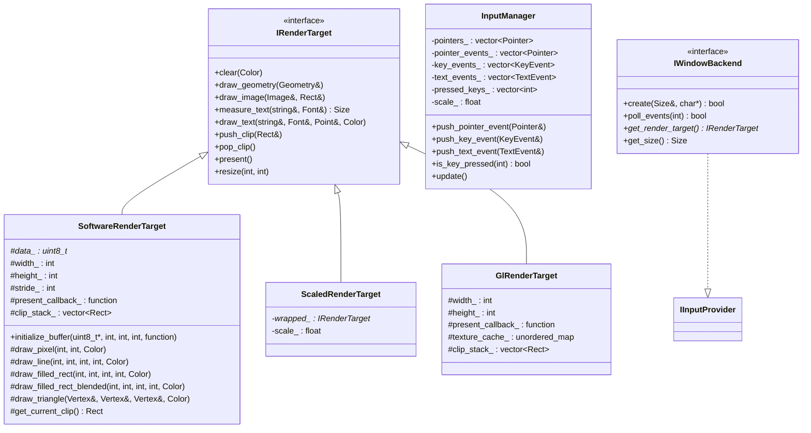
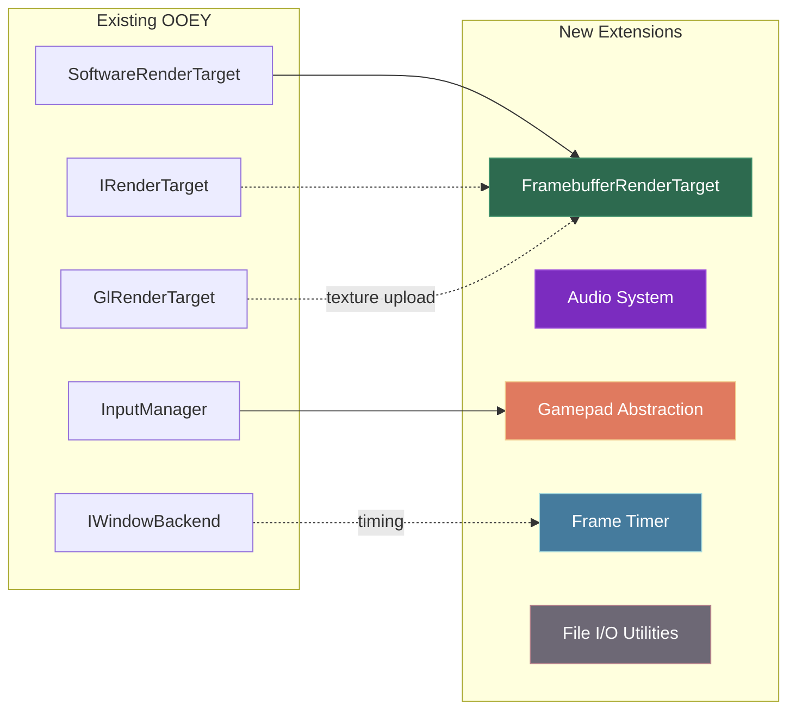
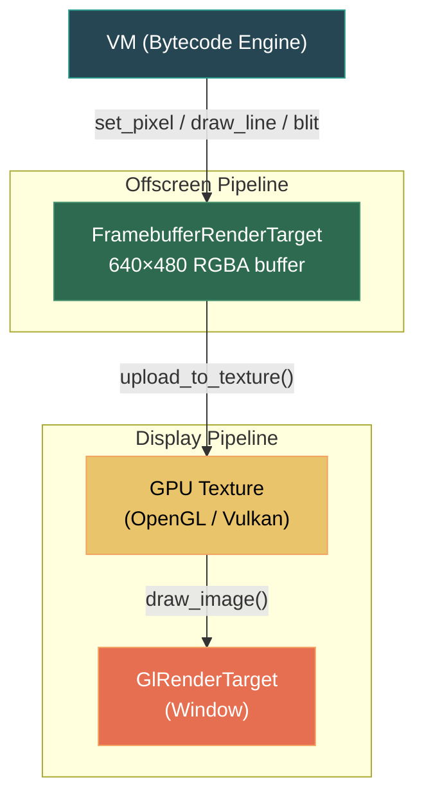
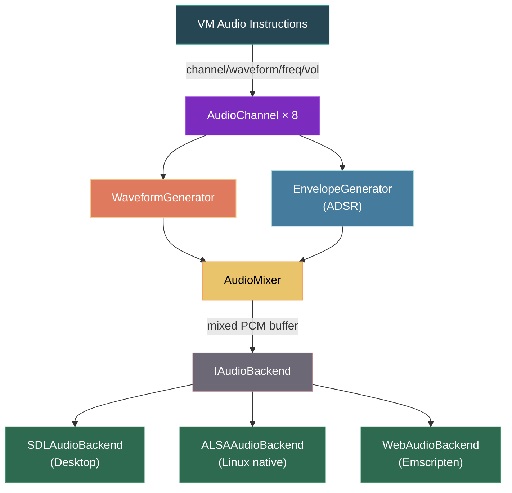
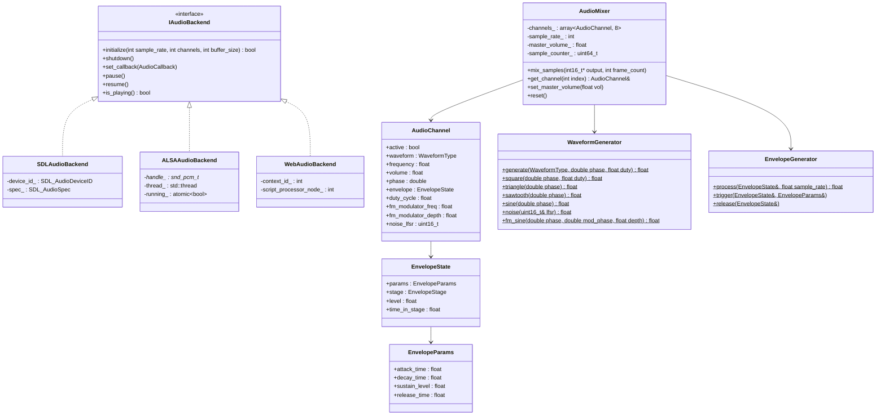
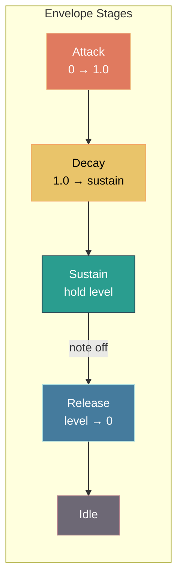
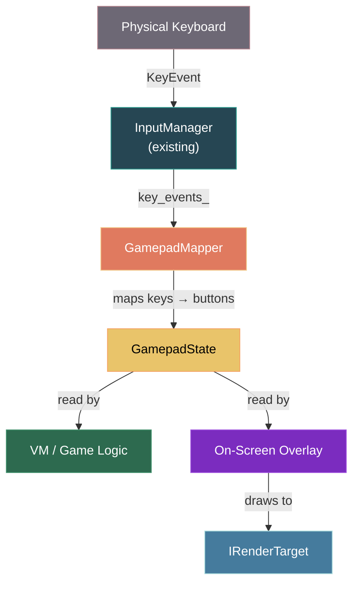
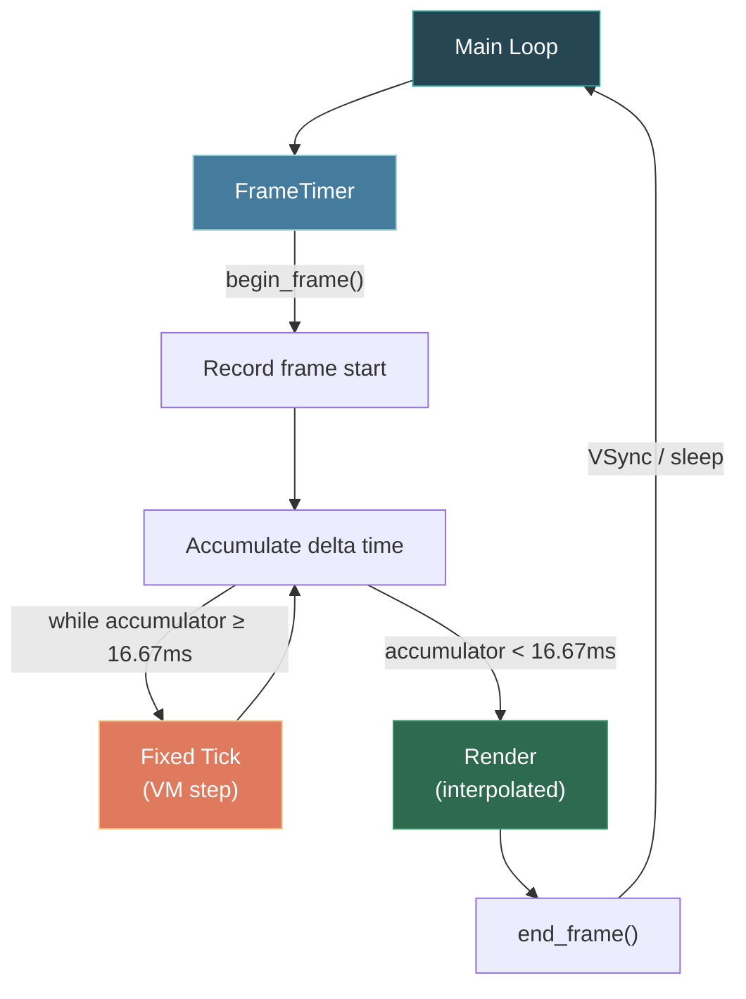
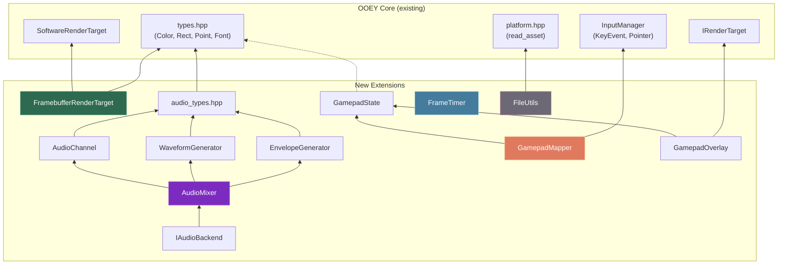

# OOEY Framework Extensions for Ooey-Station

> **Document**: 02 — Framework Extensions  
> **Status**: Design Specification  
> **Scope**: Additions/modifications to the [OOEY framework](file:///home/corey/code/ooey/) required by Ooey-Station

---

## Overview

The OOEY framework provides a solid foundation for cross-platform GUI rendering and input handling. However, the Ooey-Station game console requires several capabilities that fall outside a traditional widget toolkit. This document specifies **five extension subsystems** that must be added to OOEY to support the console's virtual hardware.

### Existing OOEY Architecture (Reference)



### Extensions Required



---

## 1. Framebuffer Render Target

### Purpose

The `FramebufferRenderTarget` provides an offscreen pixel buffer that the VM draws into at the console's native resolution (640×480). This buffer is then uploaded as a GPU texture and composited onto the actual display render target, allowing the console output to be scaled, positioned, and framed within the OOEY window.

### Architecture



### Class Interface

```cpp
// File: ooey/include/ooey/renderer/framebuffer_render_target.hpp
#pragma once

#include "ooey/renderer/software_render_target.hpp"
#include "ooey/renderer/i_render_target.hpp"
#include <array>
#include <cstdint>
#include <cstring>
#include <vector>

namespace ooey::renderer {

/// Offscreen pixel buffer render target for the Ooey-Station virtual console.
///
/// Inherits the full software rasterization pipeline from SoftwareRenderTarget
/// and adds direct pixel access, fast bulk operations, and GPU texture upload
/// for display compositing.
///
/// Typical usage:
///   1. VM draws into the framebuffer via set_pixel / draw primitives
///   2. Each frame, upload_to_texture() pushes the buffer to a GPU texture
///   3. The host render target draws the texture with draw_image()
///
class FramebufferRenderTarget : public SoftwareRenderTarget {
public:
    static constexpr int kWidth  = 640;
    static constexpr int kHeight = 480;
    static constexpr int kBpp    = 4;  // RGBA
    static constexpr int kStride = kWidth * kBpp;
    static constexpr int kBufferSize = kWidth * kHeight * kBpp;

    FramebufferRenderTarget();
    ~FramebufferRenderTarget() override;

    // ── Direct Pixel Access (VM-facing API) ──────────────────────────

    /// Set a single pixel. Coordinates are bounds-checked.
    void set_pixel(int x, int y, Color color);

    /// Get a single pixel. Returns {0,0,0,0} for out-of-bounds.
    Color get_pixel(int x, int y) const;

    /// Raw pointer to the RGBA pixel buffer (kBufferSize bytes).
    /// Layout: row-major, top-left origin, 4 bytes per pixel (R, G, B, A).
    uint8_t* pixel_data() { return buffer_.data(); }
    const uint8_t* pixel_data() const { return buffer_.data(); }

    // ── Bulk Operations ──────────────────────────────────────────────

    /// Fast-clear the entire buffer to a solid color using memset-optimized path.
    void fast_clear(Color color);

    /// Blit a rectangular region from a source buffer into this framebuffer.
    /// Source data must be RGBA, row-major, with the given stride.
    /// Clips to framebuffer bounds automatically.
    void blit(int dest_x, int dest_y, int width, int height,
              const uint8_t* src_data, int src_stride);

    /// Blit from another FramebufferRenderTarget (or a sub-region of one).
    void blit_from(const FramebufferRenderTarget& src,
                   int src_x, int src_y, int w, int h,
                   int dest_x, int dest_y);

    /// Fill a rectangle with a solid color (faster than draw_filled_rect
    /// because it bypasses clipping/blending when alpha is 255).
    void fill_rect(int x, int y, int w, int h, Color color);

    /// Scroll the buffer contents by (dx, dy) pixels.
    /// Vacated area is filled with fill_color.
    void scroll(int dx, int dy, Color fill_color = {0, 0, 0, 255});

    // ── GPU Texture Upload ───────────────────────────────────────────

    /// Upload the current pixel buffer to an OpenGL texture.
    /// Creates the texture on first call; subsequent calls update via glTexSubImage2D.
    /// Returns the GL texture ID.
    unsigned int upload_to_gl_texture();

    /// Returns the GL texture ID (0 if not yet uploaded).
    unsigned int gl_texture_id() const { return gl_texture_id_; }

    /// Mark the buffer as dirty (forces re-upload on next upload_to_gl_texture).
    void mark_dirty() { dirty_ = true; }

    /// Check if the buffer has been modified since last upload.
    bool is_dirty() const { return dirty_; }

    // ── IRenderTarget Overrides ──────────────────────────────────────

    /// Override clear to also set the dirty flag.
    void clear(Color color) override;

    /// Override present — for an offscreen target, this is a no-op.
    /// Actual display happens via upload_to_gl_texture() + host draw_image().
    void present() override;

    /// Dimensions are fixed; resize is a no-op.
    void resize(int width, int height) override {}

private:
    std::array<uint8_t, kBufferSize> buffer_;
    unsigned int gl_texture_id_{0};
    bool dirty_{true};

    /// Clamp and clip a blit region to framebuffer bounds.
    /// Returns false if the region is entirely outside.
    bool clip_blit_region(int& dest_x, int& dest_y, int& w, int& h,
                          int& src_x, int& src_y,
                          int src_w, int src_h) const;
};

} // namespace ooey::renderer

namespace ooey {
using renderer::FramebufferRenderTarget;
}
```

### Implementation Notes

#### Pixel Buffer Layout

```
Offset = (y * kStride) + (x * kBpp)

buffer_[offset + 0] = R
buffer_[offset + 1] = G
buffer_[offset + 2] = B
buffer_[offset + 3] = A
```

The buffer uses `std::array` (stack-allocated for the fixed 640×480×4 = 1,228,800 bytes ≈ 1.2 MB) to avoid heap allocation overhead. If stack constraints become an issue on embedded targets, this can be changed to `std::vector` with a reserved allocation.

#### Fast Clear Algorithm

```cpp
void FramebufferRenderTarget::fast_clear(Color color) {
    if (color.r == color.g && color.g == color.b && color.b == color.a) {
        // All components identical — single memset
        std::memset(buffer_.data(), color.r, kBufferSize);
    } else {
        // Build a 4-byte pattern and replicate across the first row,
        // then memcpy rows for the rest
        uint8_t pattern[4] = { color.r, color.g, color.b, color.a };
        uint8_t* row0 = buffer_.data();
        for (int x = 0; x < kWidth; ++x) {
            std::memcpy(row0 + x * kBpp, pattern, kBpp);
        }
        for (int y = 1; y < kHeight; ++y) {
            std::memcpy(buffer_.data() + y * kStride, row0, kStride);
        }
    }
    dirty_ = true;
}
```

#### GPU Texture Upload (OpenGL Path)

```cpp
unsigned int FramebufferRenderTarget::upload_to_gl_texture() {
    if (!dirty_) return gl_texture_id_;

    if (gl_texture_id_ == 0) {
        glGenTextures(1, &gl_texture_id_);
        glBindTexture(GL_TEXTURE_2D, gl_texture_id_);
        glTexParameteri(GL_TEXTURE_2D, GL_TEXTURE_MIN_FILTER, GL_NEAREST);
        glTexParameteri(GL_TEXTURE_2D, GL_TEXTURE_MAG_FILTER, GL_NEAREST);
        glTexParameteri(GL_TEXTURE_2D, GL_TEXTURE_WRAP_S, GL_CLAMP_TO_EDGE);
        glTexParameteri(GL_TEXTURE_2D, GL_TEXTURE_WRAP_T, GL_CLAMP_TO_EDGE);
        glTexImage2D(GL_TEXTURE_2D, 0, GL_RGBA, kWidth, kHeight, 0,
                     GL_RGBA, GL_UNSIGNED_BYTE, buffer_.data());
    } else {
        glBindTexture(GL_TEXTURE_2D, gl_texture_id_);
        glTexSubImage2D(GL_TEXTURE_2D, 0, 0, 0, kWidth, kHeight,
                        GL_RGBA, GL_UNSIGNED_BYTE, buffer_.data());
    }

    dirty_ = false;
    return gl_texture_id_;
}
```

> [!IMPORTANT]
> `GL_NEAREST` filtering is critical — the console uses pixel art aesthetics and must not blur when scaled up. The host application scales the 640×480 texture to fit the window while maintaining aspect ratio.

#### Integration with Host Render Pipeline

```cpp
// In the main render loop:
void OoeyStation::render(IRenderTarget* host_target) {
    // 1. VM has drawn into framebuffer_ during the tick
    // 2. Upload to GPU
    unsigned int tex_id = framebuffer_.upload_to_gl_texture();

    // 3. Create an Image wrapper around the texture for the host target
    //    (or use a specialized draw_texture() path on GlRenderTarget)
    Rect dest = calculate_scaled_rect(host_target, 640, 480);
    host_target->draw_image(/* texture-backed image */, dest);

    // 4. Draw shell UI (menus, overlays) on top
    shell_.render(host_target);
}
```

---

## 2. Audio System

### Purpose

A complete audio subsystem providing chiptune-style sound synthesis with 8 simultaneous channels, waveform generation, ADSR envelopes, and platform-abstracted output. This enables the VM to play sound effects and music through a programmable synthesizer.

### Architecture



### Class Hierarchy



### Complete Header Interfaces

#### `IAudioBackend` — Platform Abstraction

```cpp
// File: ooey/include/ooey/audio/i_audio_backend.hpp
#pragma once

#include <cstdint>
#include <functional>

namespace ooey::audio {

/// Callback signature for audio rendering.
/// The backend calls this to request mixed audio data.
///   output:      buffer to fill with interleaved 16-bit PCM samples
///   frame_count: number of stereo frames requested (total samples = frame_count * channels)
using AudioCallback = std::function<void(int16_t* output, int frame_count)>;

class IAudioBackend {
public:
    virtual ~IAudioBackend() = default;

    /// Initialize the audio device.
    /// @param sample_rate  Samples per second (typically 44100)
    /// @param channels     Number of output channels (1 = mono, 2 = stereo)
    /// @param buffer_size  Preferred buffer size in frames (e.g., 512 or 1024)
    /// @return true on success
    virtual bool initialize(int sample_rate, int channels, int buffer_size) = 0;

    /// Shut down the audio device and release resources.
    virtual void shutdown() = 0;

    /// Set the callback that will be invoked to generate audio data.
    /// This callback runs on the audio thread — it must be lock-free and fast.
    virtual void set_callback(AudioCallback callback) = 0;

    /// Pause audio playback (callback stops being invoked).
    virtual void pause() = 0;

    /// Resume audio playback.
    virtual void resume() = 0;

    /// Returns true if audio is currently playing (not paused).
    virtual bool is_playing() const = 0;

    /// Returns the actual sample rate negotiated with the hardware.
    virtual int actual_sample_rate() const = 0;
};

} // namespace ooey::audio
```

#### Waveform Types and Envelope

```cpp
// File: ooey/include/ooey/audio/audio_types.hpp
#pragma once

#include <cstdint>

namespace ooey::audio {

/// Waveform types supported by the synthesizer.
enum class WaveformType : uint8_t {
    Square   = 0,
    Triangle = 1,
    Sawtooth = 2,
    Sine     = 3,
    Noise    = 4,
    FMSine   = 5,   // Frequency-modulated sine
    Silence  = 255
};

/// ADSR envelope stages.
enum class EnvelopeStage : uint8_t {
    Idle,       // Not active
    Attack,     // Rising from 0 to 1
    Decay,      // Falling from 1 to sustain level
    Sustain,    // Held at sustain level
    Release     // Falling from current level to 0
};

/// ADSR envelope parameters (times in seconds).
struct EnvelopeParams {
    float attack_time{0.01f};    // seconds
    float decay_time{0.1f};      // seconds
    float sustain_level{0.7f};   // 0.0 – 1.0
    float release_time{0.2f};    // seconds
};

/// Runtime state for an active envelope instance.
struct EnvelopeState {
    EnvelopeParams params;
    EnvelopeStage  stage{EnvelopeStage::Idle};
    float          level{0.0f};           // Current envelope amplitude (0.0 – 1.0)
    float          time_in_stage{0.0f};   // Seconds elapsed in current stage
    float          release_start_level{0.0f}; // Level when release was triggered
};

} // namespace ooey::audio
```

#### `AudioChannel` — Single Channel State

```cpp
// File: ooey/include/ooey/audio/audio_channel.hpp
#pragma once

#include "ooey/audio/audio_types.hpp"

namespace ooey::audio {

/// State for one of the 8 synthesizer channels.
struct AudioChannel {
    bool          active{false};
    WaveformType  waveform{WaveformType::Square};
    float         frequency{440.0f};     // Hz
    float         volume{1.0f};          // 0.0 – 1.0
    double        phase{0.0};            // Current waveform phase (0.0 – 1.0)
    float         duty_cycle{0.5f};      // Square wave duty cycle

    // FM synthesis parameters (used when waveform == FMSine)
    float         fm_modulator_freq{0.0f};
    float         fm_modulator_depth{0.0f};
    double        fm_modulator_phase{0.0};

    // Noise generator state (linear feedback shift register)
    uint16_t      noise_lfsr{0x1234};

    // ADSR envelope
    EnvelopeState envelope;

    /// Reset the channel to default state.
    void reset() {
        active = false;
        waveform = WaveformType::Square;
        frequency = 440.0f;
        volume = 1.0f;
        phase = 0.0;
        duty_cycle = 0.5f;
        fm_modulator_freq = 0.0f;
        fm_modulator_depth = 0.0f;
        fm_modulator_phase = 0.0;
        noise_lfsr = 0x1234;
        envelope = {};
    }
};

} // namespace ooey::audio
```

#### `WaveformGenerator` — Signal Synthesis

```cpp
// File: ooey/include/ooey/audio/waveform_generator.hpp
#pragma once

#include "ooey/audio/audio_types.hpp"
#include <cmath>
#include <numbers>

namespace ooey::audio {

/// Stateless waveform generator — all functions are pure.
/// Phase values are normalized to [0.0, 1.0).
class WaveformGenerator {
public:
    /// Generate a sample for the given waveform type.
    /// Returns a value in [-1.0, 1.0].
    static float generate(WaveformType type, double phase,
                          float duty_cycle = 0.5f,
                          uint16_t* lfsr = nullptr,
                          double fm_mod_phase = 0.0,
                          float fm_depth = 0.0f) {
        switch (type) {
            case WaveformType::Square:   return square(phase, duty_cycle);
            case WaveformType::Triangle: return triangle(phase);
            case WaveformType::Sawtooth: return sawtooth(phase);
            case WaveformType::Sine:     return sine(phase);
            case WaveformType::Noise:    return lfsr ? noise(*lfsr) : 0.0f;
            case WaveformType::FMSine:   return fm_sine(phase, fm_mod_phase, fm_depth);
            case WaveformType::Silence:  return 0.0f;
        }
        return 0.0f;
    }

    /// Square wave: +1 when phase < duty, -1 otherwise.
    static float square(double phase, float duty_cycle = 0.5f) {
        return phase < duty_cycle ? 1.0f : -1.0f;
    }

    /// Triangle wave: linear ramp from -1 to +1 and back.
    static float triangle(double phase) {
        if (phase < 0.25) return static_cast<float>(phase * 4.0);
        if (phase < 0.75) return static_cast<float>(2.0 - phase * 4.0);
        return static_cast<float>(phase * 4.0 - 4.0);
    }

    /// Sawtooth wave: linear ramp from -1 to +1.
    static float sawtooth(double phase) {
        return static_cast<float>(2.0 * phase - 1.0);
    }

    /// Sine wave.
    static float sine(double phase) {
        return static_cast<float>(
            std::sin(phase * 2.0 * std::numbers::pi));
    }

    /// Noise via 16-bit Galois LFSR (taps: bits 0 and 2).
    /// Produces pseudo-random values in [-1.0, 1.0].
    static float noise(uint16_t& lfsr) {
        // Clock the LFSR
        bool bit = lfsr & 1;
        lfsr >>= 1;
        if (bit) lfsr ^= 0xB400;  // Taps at bits 15, 13, 12, 10
        // Normalize to [-1, 1]
        return static_cast<float>(lfsr) / 32767.5f - 1.0f;
    }

    /// FM synthesis: carrier sine modulated by another sine.
    /// fm_depth controls the modulation index.
    static float fm_sine(double carrier_phase, double modulator_phase, float fm_depth) {
        float mod = static_cast<float>(
            std::sin(modulator_phase * 2.0 * std::numbers::pi));
        return static_cast<float>(
            std::sin((carrier_phase + fm_depth * mod) * 2.0 * std::numbers::pi));
    }
};

} // namespace ooey::audio
```

#### `EnvelopeGenerator` — ADSR Processing

```cpp
// File: ooey/include/ooey/audio/envelope_generator.hpp
#pragma once

#include "ooey/audio/audio_types.hpp"
#include <algorithm>

namespace ooey::audio {

/// Processes ADSR envelope state, advancing by one sample per call.
class EnvelopeGenerator {
public:
    /// Advance the envelope by one sample. Returns the current envelope level.
    static float process(EnvelopeState& state, float sample_rate) {
        if (state.stage == EnvelopeStage::Idle) return 0.0f;

        float dt = 1.0f / sample_rate;
        state.time_in_stage += dt;

        switch (state.stage) {
            case EnvelopeStage::Attack: {
                if (state.params.attack_time <= 0.0f) {
                    state.level = 1.0f;
                    transition(state, EnvelopeStage::Decay);
                } else {
                    state.level = state.time_in_stage / state.params.attack_time;
                    if (state.level >= 1.0f) {
                        state.level = 1.0f;
                        transition(state, EnvelopeStage::Decay);
                    }
                }
                break;
            }
            case EnvelopeStage::Decay: {
                if (state.params.decay_time <= 0.0f) {
                    state.level = state.params.sustain_level;
                    transition(state, EnvelopeStage::Sustain);
                } else {
                    float t = state.time_in_stage / state.params.decay_time;
                    state.level = 1.0f + (state.params.sustain_level - 1.0f) * t;
                    if (state.level <= state.params.sustain_level) {
                        state.level = state.params.sustain_level;
                        transition(state, EnvelopeStage::Sustain);
                    }
                }
                break;
            }
            case EnvelopeStage::Sustain: {
                state.level = state.params.sustain_level;
                // Stays here until release() is called
                break;
            }
            case EnvelopeStage::Release: {
                if (state.params.release_time <= 0.0f) {
                    state.level = 0.0f;
                    transition(state, EnvelopeStage::Idle);
                } else {
                    float t = state.time_in_stage / state.params.release_time;
                    state.level = state.release_start_level * (1.0f - t);
                    if (state.level <= 0.0f) {
                        state.level = 0.0f;
                        transition(state, EnvelopeStage::Idle);
                    }
                }
                break;
            }
            case EnvelopeStage::Idle:
                break;
        }

        return std::clamp(state.level, 0.0f, 1.0f);
    }

    /// Trigger the envelope (note on). Resets to Attack stage.
    static void trigger(EnvelopeState& state, const EnvelopeParams& params) {
        state.params = params;
        state.stage = EnvelopeStage::Attack;
        state.level = 0.0f;
        state.time_in_stage = 0.0f;
    }

    /// Release the envelope (note off). Transitions to Release stage.
    static void release(EnvelopeState& state) {
        if (state.stage != EnvelopeStage::Idle) {
            state.release_start_level = state.level;
            transition(state, EnvelopeStage::Release);
        }
    }

private:
    static void transition(EnvelopeState& state, EnvelopeStage new_stage) {
        state.stage = new_stage;
        state.time_in_stage = 0.0f;
    }
};

} // namespace ooey::audio
```

#### `AudioMixer` — Channel Mixing

```cpp
// File: ooey/include/ooey/audio/audio_mixer.hpp
#pragma once

#include "ooey/audio/audio_channel.hpp"
#include "ooey/audio/waveform_generator.hpp"
#include "ooey/audio/envelope_generator.hpp"
#include <array>
#include <algorithm>
#include <cstdint>

namespace ooey::audio {

class AudioMixer {
public:
    static constexpr int kNumChannels = 8;
    static constexpr int kSampleRate  = 44100;

    AudioMixer() = default;

    /// Called by the audio backend on the audio thread.
    /// Fills the output buffer with interleaved mono 16-bit PCM samples.
    void mix_samples(int16_t* output, int frame_count) {
        for (int i = 0; i < frame_count; ++i) {
            float mixed = 0.0f;
            int active_count = 0;

            for (auto& ch : channels_) {
                if (!ch.active) continue;
                if (ch.envelope.stage == EnvelopeStage::Idle) {
                    ch.active = false;
                    continue;
                }

                // Generate waveform sample
                float sample = WaveformGenerator::generate(
                    ch.waveform, ch.phase, ch.duty_cycle,
                    &ch.noise_lfsr, ch.fm_modulator_phase, ch.fm_modulator_depth);

                // Apply envelope
                float env_level = EnvelopeGenerator::process(
                    ch.envelope, static_cast<float>(kSampleRate));

                // Apply volume and envelope
                sample *= ch.volume * env_level;
                mixed += sample;

                // Advance phase
                ch.phase += ch.frequency / kSampleRate;
                if (ch.phase >= 1.0) ch.phase -= 1.0;

                // Advance FM modulator phase
                if (ch.waveform == WaveformType::FMSine) {
                    ch.fm_modulator_phase += ch.fm_modulator_freq / kSampleRate;
                    if (ch.fm_modulator_phase >= 1.0) ch.fm_modulator_phase -= 1.0;
                }

                ++active_count;
            }

            // Normalize to prevent clipping when many channels are active
            if (active_count > 1) {
                mixed /= std::sqrt(static_cast<float>(active_count));
            }

            // Apply master volume and clamp
            mixed *= master_volume_;
            mixed = std::clamp(mixed, -1.0f, 1.0f);

            // Convert to 16-bit PCM
            output[i] = static_cast<int16_t>(mixed * 32767.0f);
        }

        sample_counter_ += frame_count;
    }

    /// Get a reference to a channel for configuration.
    AudioChannel& get_channel(int index) {
        return channels_[std::clamp(index, 0, kNumChannels - 1)];
    }

    const AudioChannel& get_channel(int index) const {
        return channels_[std::clamp(index, 0, kNumChannels - 1)];
    }

    /// Set the master volume (0.0 – 1.0).
    void set_master_volume(float vol) {
        master_volume_ = std::clamp(vol, 0.0f, 1.0f);
    }

    float master_volume() const { return master_volume_; }

    /// Reset all channels to inactive.
    void reset() {
        for (auto& ch : channels_) ch.reset();
        sample_counter_ = 0;
    }

    /// Total samples generated since last reset.
    uint64_t sample_counter() const { return sample_counter_; }

private:
    std::array<AudioChannel, kNumChannels> channels_;
    float master_volume_{0.8f};
    uint64_t sample_counter_{0};
};

} // namespace ooey::audio
```

### ADSR Envelope Diagram



```
Amplitude
  1.0 ┤    /\
      │   /  \
      │  /    \___________
  S   │ /                  \
      │/                    \
  0.0 └───────────────────────── Time
      │ A │  D  │    S    │ R │
```

### Platform Backend Implementation Notes

#### SDL Audio Backend

```cpp
// File: ooey/include/ooey/audio/sdl_audio_backend.hpp
#pragma once

#include "ooey/audio/i_audio_backend.hpp"

namespace ooey::audio {

class SDLAudioBackend : public IAudioBackend {
public:
    SDLAudioBackend() = default;
    ~SDLAudioBackend() override { shutdown(); }

    bool initialize(int sample_rate, int channels, int buffer_size) override;
    void shutdown() override;
    void set_callback(AudioCallback callback) override;
    void pause() override;
    void resume() override;
    bool is_playing() const override;
    int actual_sample_rate() const override;

private:
    // SDL_AudioDeviceID
    unsigned int device_id_{0};
    AudioCallback callback_;
    int actual_sample_rate_{0};
    bool playing_{false};

    /// Static callback trampoline for SDL_AudioSpec.
    static void sdl_audio_callback(void* userdata, uint8_t* stream, int len);
};

} // namespace ooey::audio
```

**Implementation strategy**: Use `SDL_OpenAudioDevice()` with a desired `SDL_AudioSpec` requesting 44100 Hz, `AUDIO_S16SYS`, mono, and the requested buffer size. The static callback calls the stored `AudioCallback` which drives `AudioMixer::mix_samples()`.

#### Web Audio Backend (Emscripten)

```cpp
// File: ooey/include/ooey/audio/web_audio_backend.hpp
#pragma once

#include "ooey/audio/i_audio_backend.hpp"

namespace ooey::audio {

class WebAudioBackend : public IAudioBackend {
public:
    WebAudioBackend() = default;
    ~WebAudioBackend() override { shutdown(); }

    bool initialize(int sample_rate, int channels, int buffer_size) override;
    void shutdown() override;
    void set_callback(AudioCallback callback) override;
    void pause() override;
    void resume() override;
    bool is_playing() const override;
    int actual_sample_rate() const override;

private:
    int context_id_{-1};
    AudioCallback callback_;
    int actual_sample_rate_{0};
    bool playing_{false};
};

} // namespace ooey::audio
```

**Implementation strategy**: Uses Emscripten's `EM_ASM` / `EM_JS` to create a Web Audio `AudioContext` and `ScriptProcessorNode` (or `AudioWorkletNode` where supported). The audio callback is invoked from JavaScript, filling a shared buffer that gets copied to the audio output.

#### ALSA Backend (Linux Native)

```cpp
// File: ooey/include/ooey/audio/alsa_audio_backend.hpp
#pragma once

#include "ooey/audio/i_audio_backend.hpp"
#include <atomic>
#include <thread>

namespace ooey::audio {

class ALSAAudioBackend : public IAudioBackend {
public:
    ALSAAudioBackend() = default;
    ~ALSAAudioBackend() override { shutdown(); }

    bool initialize(int sample_rate, int channels, int buffer_size) override;
    void shutdown() override;
    void set_callback(AudioCallback callback) override;
    void pause() override;
    void resume() override;
    bool is_playing() const override;
    int actual_sample_rate() const override;

private:
    void* pcm_handle_{nullptr};  // snd_pcm_t* (avoid ALSA header in public API)
    std::thread audio_thread_;
    std::atomic<bool> running_{false};
    std::atomic<bool> paused_{false};
    AudioCallback callback_;
    int actual_sample_rate_{0};
    int buffer_size_{0};

    /// Audio thread main loop.
    void audio_thread_func();
};

} // namespace ooey::audio
```

**Implementation strategy**: Opens the `"default"` ALSA device with `snd_pcm_open()`, configures hardware params for 44100 Hz S16_LE mono, then spawns a dedicated thread that calls the `AudioCallback` to fill buffers and writes them with `snd_pcm_writei()`.

### Integration with OOEY

The audio system registers as a peer to the existing `InputManager` pattern — it's created and owned by the application scaffold:

```cpp
// In the Application or OoeyStation initialization:
auto audio_backend = std::make_unique<SDLAudioBackend>();
audio_backend->initialize(44100, 1, 512);

auto mixer = std::make_shared<AudioMixer>();
audio_backend->set_callback([mixer](int16_t* out, int frames) {
    mixer->mix_samples(out, frames);
});

audio_backend->resume();
// mixer is passed to the VM for channel manipulation
```

---

## 3. Gamepad Input Abstraction

### Purpose

Provides a higher-level gamepad interface on top of the existing `InputManager`, mapping keyboard events to a virtual gamepad with D-pad, face buttons, and system buttons. Supports pressed/held/released state tracking and an optional on-screen overlay.

### Architecture



### Class Interfaces

#### `GamepadState` — Button State Container

```cpp
// File: ooey/include/ooey/input/gamepad_state.hpp
#pragma once

#include <cstdint>

namespace ooey::input {

/// Identifies each button on the virtual gamepad.
enum class GamepadButton : uint8_t {
    DPadUp    = 0,
    DPadDown  = 1,
    DPadLeft  = 2,
    DPadRight = 3,
    A         = 4,   // Primary action
    B         = 5,   // Secondary action
    C         = 6,   // Tertiary action
    X         = 7,   // Alt action 1
    Y         = 8,   // Alt action 2
    Z         = 9,   // Alt action 3
    Start     = 10,
    Select    = 11,

    kCount    = 12
};

/// Snapshot of all gamepad button states for a single frame.
/// Tracks three distinct states per button:
///   - pressed:  true only on the frame the button was first pressed
///   - held:     true while the button is physically down
///   - released: true only on the frame the button was released
struct GamepadState {
    /// Per-button state arrays indexed by GamepadButton.
    bool pressed [static_cast<int>(GamepadButton::kCount)] {};
    bool held    [static_cast<int>(GamepadButton::kCount)] {};
    bool released[static_cast<int>(GamepadButton::kCount)] {};

    /// Convenience accessors.
    bool is_pressed(GamepadButton btn) const {
        return pressed[static_cast<int>(btn)];
    }
    bool is_held(GamepadButton btn) const {
        return held[static_cast<int>(btn)];
    }
    bool is_released(GamepadButton btn) const {
        return released[static_cast<int>(btn)];
    }

    /// Clear transient states (pressed/released) — call at start of each frame.
    void begin_frame() {
        for (int i = 0; i < static_cast<int>(GamepadButton::kCount); ++i) {
            pressed[i] = false;
            released[i] = false;
        }
    }

    /// Clear all state.
    void reset() {
        for (int i = 0; i < static_cast<int>(GamepadButton::kCount); ++i) {
            pressed[i] = false;
            held[i] = false;
            released[i] = false;
        }
    }
};

} // namespace ooey::input
```

#### `GamepadMapper` — Keyboard-to-Gamepad Translation

```cpp
// File: ooey/include/ooey/input/gamepad_mapper.hpp
#pragma once

#include "ooey/input/gamepad_state.hpp"
#include "ooey/input.hpp"
#include <unordered_map>
#include <vector>

namespace ooey::input {

/// Maps physical keyboard key codes to virtual gamepad buttons.
/// Processes KeyEvents from InputManager each frame and updates GamepadState.
class GamepadMapper {
public:
    GamepadMapper();

    /// Process all key events from the current frame and update the gamepad state.
    /// Call this once per frame after InputManager has collected events.
    void update(const ooey::InputManager& input_manager);

    /// Get the current gamepad state (read-only).
    const GamepadState& state() const { return state_; }

    // ── Mapping Configuration ────────────────────────────────────────

    /// Bind a keyboard key code to a gamepad button.
    /// Multiple keys can map to the same button (e.g., WASD + arrows → D-pad).
    void bind(int key_code, GamepadButton button);

    /// Remove all bindings for a specific key code.
    void unbind(int key_code);

    /// Remove all bindings for a specific button.
    void unbind_button(GamepadButton button);

    /// Reset to default key bindings.
    void reset_to_defaults();

    /// Get all key codes bound to a button.
    std::vector<int> get_bindings(GamepadButton button) const;

    // ── Default Key Code Constants ───────────────────────────────────
    // These use X11/Linux key codes. Platform abstraction can remap.

    // D-Pad: WASD + Arrow keys
    static constexpr int kDefaultUpKey1     = 'w';     // W
    static constexpr int kDefaultUpKey2     = 0xFF52;  // XK_Up
    static constexpr int kDefaultDownKey1   = 's';     // S
    static constexpr int kDefaultDownKey2   = 0xFF54;  // XK_Down
    static constexpr int kDefaultLeftKey1   = 'a';     // A
    static constexpr int kDefaultLeftKey2   = 0xFF51;  // XK_Left
    static constexpr int kDefaultRightKey1  = 'd';     // D
    static constexpr int kDefaultRightKey2  = 0xFF53;  // XK_Right

    // Face buttons: JKL → A/B/C
    static constexpr int kDefaultAKey       = 'j';     // J
    static constexpr int kDefaultBKey       = 'k';     // K
    static constexpr int kDefaultCKey       = 'l';     // L

    // Shoulder/extra buttons: UIO → X/Y/Z
    static constexpr int kDefaultXKey       = 'u';     // U
    static constexpr int kDefaultYKey       = 'i';     // I
    static constexpr int kDefaultZKey       = 'o';     // O

    // System buttons
    static constexpr int kDefaultStartKey   = 0xFF0D;  // XK_Return (Enter)
    static constexpr int kDefaultSelectKey  = 0xFF08;  // XK_BackSpace

private:
    GamepadState state_;
    std::unordered_map<int, GamepadButton> key_to_button_;
};

} // namespace ooey::input
```

#### Implementation: `GamepadMapper::update()`

```cpp
// File: ooey/src/input/gamepad_mapper.cpp

#include "ooey/input/gamepad_mapper.hpp"

namespace ooey::input {

GamepadMapper::GamepadMapper() {
    reset_to_defaults();
}

void GamepadMapper::reset_to_defaults() {
    key_to_button_.clear();

    // D-Pad: two keys each (WASD + arrows)
    bind(kDefaultUpKey1,    GamepadButton::DPadUp);
    bind(kDefaultUpKey2,    GamepadButton::DPadUp);
    bind(kDefaultDownKey1,  GamepadButton::DPadDown);
    bind(kDefaultDownKey2,  GamepadButton::DPadDown);
    bind(kDefaultLeftKey1,  GamepadButton::DPadLeft);
    bind(kDefaultLeftKey2,  GamepadButton::DPadLeft);
    bind(kDefaultRightKey1, GamepadButton::DPadRight);
    bind(kDefaultRightKey2, GamepadButton::DPadRight);

    // Face buttons
    bind(kDefaultAKey, GamepadButton::A);
    bind(kDefaultBKey, GamepadButton::B);
    bind(kDefaultCKey, GamepadButton::C);

    // Extra buttons
    bind(kDefaultXKey, GamepadButton::X);
    bind(kDefaultYKey, GamepadButton::Y);
    bind(kDefaultZKey, GamepadButton::Z);

    // System
    bind(kDefaultStartKey,  GamepadButton::Start);
    bind(kDefaultSelectKey, GamepadButton::Select);
}

void GamepadMapper::update(const ooey::InputManager& input_manager) {
    // Clear transient states from last frame
    state_.begin_frame();

    // Process key events for this frame
    for (const auto& event : input_manager.get_key_events()) {
        auto it = key_to_button_.find(event.key_code);
        if (it == key_to_button_.end()) continue;

        int idx = static_cast<int>(it->second);

        if (event.state == ooey::KeyState::Pressed) {
            if (!state_.held[idx]) {
                state_.pressed[idx] = true;
                state_.held[idx] = true;
            }
        } else if (event.state == ooey::KeyState::Released) {
            state_.held[idx] = false;
            state_.released[idx] = true;
        }
    }
}

void GamepadMapper::bind(int key_code, GamepadButton button) {
    key_to_button_[key_code] = button;
}

void GamepadMapper::unbind(int key_code) {
    key_to_button_.erase(key_code);
}

void GamepadMapper::unbind_button(GamepadButton button) {
    for (auto it = key_to_button_.begin(); it != key_to_button_.end();) {
        if (it->second == button) {
            it = key_to_button_.erase(it);
        } else {
            ++it;
        }
    }
}

std::vector<int> GamepadMapper::get_bindings(GamepadButton button) const {
    std::vector<int> keys;
    for (const auto& [key, btn] : key_to_button_) {
        if (btn == button) keys.push_back(key);
    }
    return keys;
}

} // namespace ooey::input
```

### Default Key Mapping Reference

| Gamepad Button | Primary Key | Secondary Key | Key Codes |
|:---|:---|:---|:---|
| D-Pad Up | `W` | `↑` Arrow | `0x77` / `0xFF52` |
| D-Pad Down | `S` | `↓` Arrow | `0x73` / `0xFF54` |
| D-Pad Left | `A` | `←` Arrow | `0x61` / `0xFF51` |
| D-Pad Right | `D` | `→` Arrow | `0x64` / `0xFF53` |
| A (action) | `J` | — | `0x6A` |
| B (action) | `K` | — | `0x6B` |
| C (action) | `L` | — | `0x6C` |
| X (extra) | `U` | — | `0x75` |
| Y (extra) | `I` | — | `0x69` |
| Z (extra) | `O` | — | `0x6F` |
| Start | `Enter` | — | `0xFF0D` |
| Select | `Backspace` | — | `0xFF08` |

### On-Screen Gamepad Overlay

```cpp
// File: ooey/include/ooey/input/gamepad_overlay.hpp
#pragma once

#include "ooey/input/gamepad_state.hpp"
#include "ooey/renderer/i_render_target.hpp"
#include "ooey/types.hpp"

namespace ooey::input {

/// Renders a semi-transparent gamepad overlay onto the screen.
/// Highlights buttons that are currently held for visual feedback.
class GamepadOverlay {
public:
    GamepadOverlay() = default;

    /// Enable/disable the overlay.
    void set_visible(bool visible) { visible_ = visible; }
    bool is_visible() const { return visible_; }

    /// Set the overlay opacity (0.0 = invisible, 1.0 = opaque).
    void set_opacity(float opacity) { opacity_ = opacity; }

    /// Set the position of the overlay (bottom-right corner by default).
    void set_position(Point position) { position_ = position; }

    /// Render the overlay using the current gamepad state.
    void render(ooey::IRenderTarget* target, const GamepadState& state);

private:
    bool visible_{false};
    float opacity_{0.4f};
    Point position_{0, 0};  // 0,0 = auto-position to bottom-right

    // Internal rendering helpers
    void draw_dpad(ooey::IRenderTarget* target, Point origin, const GamepadState& state);
    void draw_button(ooey::IRenderTarget* target, Point center, int radius,
                     const char* label, bool is_held, Color active_color);
};

} // namespace ooey::input
```

**Implementation notes**: The overlay draws using OOEY's existing `draw_geometry()` (triangles for the D-pad arrows), `draw_filled_rect()` (via geometry), and `draw_text()` for button labels. Each button is rendered as a circle (approximated with triangles) that changes color when `held == true`. The overlay uses alpha-blended drawing at the configured opacity.

---

## 4. Frame Timer / Tick System

### Purpose

Provides deterministic fixed-timestep game loop timing with delta time tracking, frame counting, VSync support, and performance metrics. This ensures the VM runs at a consistent 60 FPS regardless of display refresh rate or render time variance.

### Architecture



### Class Interface

```cpp
// File: ooey/include/ooey/timing/frame_timer.hpp
#pragma once

#include <chrono>
#include <cstdint>

namespace ooey::timing {

/// Fixed-timestep frame timer for deterministic game loop execution.
///
/// Usage pattern:
///   timer.begin_frame();
///   while (timer.should_tick()) {
///       vm.execute_tick();        // Fixed 16.67ms steps
///       timer.consume_tick();
///   }
///   float alpha = timer.interpolation_alpha();
///   render(alpha);               // Smooth rendering between ticks
///   timer.end_frame();
///
class FrameTimer {
public:
    using Clock = std::chrono::steady_clock;
    using Duration = std::chrono::duration<double>;
    using TimePoint = Clock::time_point;

    /// Target frames per second.
    static constexpr double kTargetFPS = 60.0;

    /// Fixed timestep duration in seconds.
    static constexpr double kFixedTimestep = 1.0 / kTargetFPS;

    /// Fixed timestep in milliseconds.
    static constexpr double kFixedTimestepMs = kFixedTimestep * 1000.0;

    /// Maximum delta time cap (prevents spiral of death).
    static constexpr double kMaxDeltaTime = 0.25;  // 250ms = 4 FPS minimum

    FrameTimer() = default;

    // ── Frame Lifecycle ──────────────────────────────────────────────

    /// Call at the start of each frame. Computes delta time and accumulates.
    void begin_frame();

    /// Returns true if the accumulator has enough time for another fixed tick.
    bool should_tick() const {
        return accumulator_ >= kFixedTimestep;
    }

    /// Consume one fixed timestep from the accumulator.
    /// Call after processing one tick.
    void consume_tick() {
        accumulator_ -= kFixedTimestep;
        ++tick_count_;
    }

    /// Call at the end of each frame. Optionally sleeps to maintain target FPS
    /// when VSync is not available.
    void end_frame();

    // ── Timing Queries ───────────────────────────────────────────────

    /// Interpolation alpha for rendering between ticks (0.0 – 1.0).
    /// Use this to interpolate visual state for smooth rendering.
    float interpolation_alpha() const {
        return static_cast<float>(accumulator_ / kFixedTimestep);
    }

    /// Raw delta time for the current frame (seconds).
    double delta_time() const { return delta_time_; }

    /// Total number of fixed ticks executed since reset.
    uint64_t tick_count() const { return tick_count_; }

    /// Total number of rendered frames since reset.
    uint64_t frame_count() const { return frame_count_; }

    /// Average FPS over the last second (smoothed).
    double average_fps() const { return average_fps_; }

    /// Instantaneous FPS (1 / delta_time).
    double instant_fps() const {
        return delta_time_ > 0.0 ? 1.0 / delta_time_ : 0.0;
    }

    // ── Configuration ────────────────────────────────────────────────

    /// Enable/disable VSync-based timing.
    /// When enabled, end_frame() does not sleep (relies on swap interval).
    void set_vsync_enabled(bool enabled) { vsync_enabled_ = enabled; }
    bool vsync_enabled() const { return vsync_enabled_; }

    /// Enable/disable the frame rate cap.
    /// When disabled, ticks run as fast as possible (for benchmarking).
    void set_capped(bool capped) { capped_ = capped; }
    bool is_capped() const { return capped_; }

    /// Reset all counters and timing state.
    void reset();

private:
    TimePoint last_frame_time_{};
    TimePoint frame_start_time_{};
    double delta_time_{0.0};
    double accumulator_{0.0};
    uint64_t tick_count_{0};
    uint64_t frame_count_{0};

    // FPS tracking
    double fps_accumulator_{0.0};
    int fps_frame_count_{0};
    double average_fps_{0.0};

    bool vsync_enabled_{false};
    bool capped_{true};
    bool first_frame_{true};
};

} // namespace ooey::timing
```

### Implementation

```cpp
// File: ooey/src/timing/frame_timer.cpp

#include "ooey/timing/frame_timer.hpp"
#include <thread>
#include <algorithm>

namespace ooey::timing {

void FrameTimer::begin_frame() {
    frame_start_time_ = Clock::now();

    if (first_frame_) {
        last_frame_time_ = frame_start_time_;
        first_frame_ = false;
        delta_time_ = kFixedTimestep;  // Assume one tick on first frame
    } else {
        Duration elapsed = frame_start_time_ - last_frame_time_;
        delta_time_ = elapsed.count();

        // Cap delta time to prevent spiral of death
        // (e.g., after a breakpoint or system sleep)
        delta_time_ = std::min(delta_time_, kMaxDeltaTime);
    }

    last_frame_time_ = frame_start_time_;

    // Accumulate time for fixed timestep processing
    accumulator_ += delta_time_;

    ++frame_count_;
}

void FrameTimer::end_frame() {
    // FPS tracking — update once per second
    fps_accumulator_ += delta_time_;
    ++fps_frame_count_;
    if (fps_accumulator_ >= 1.0) {
        average_fps_ = fps_frame_count_ / fps_accumulator_;
        fps_accumulator_ = 0.0;
        fps_frame_count_ = 0;
    }

    // Frame rate cap (when VSync is not handling timing)
    if (capped_ && !vsync_enabled_) {
        auto frame_end = Clock::now();
        Duration frame_duration = frame_end - frame_start_time_;
        double target_duration = kFixedTimestep;

        if (frame_duration.count() < target_duration) {
            double sleep_time = target_duration - frame_duration.count();
            // Sleep for most of the remaining time, then busy-wait for precision
            if (sleep_time > 0.002) {  // > 2ms
                std::this_thread::sleep_for(
                    std::chrono::microseconds(
                        static_cast<int64_t>((sleep_time - 0.001) * 1e6)));
            }
            // Busy-wait for the remainder (sub-millisecond precision)
            while (true) {
                auto now = Clock::now();
                Duration elapsed = now - frame_start_time_;
                if (elapsed.count() >= target_duration) break;
            }
        }
    }
}

void FrameTimer::reset() {
    last_frame_time_ = {};
    frame_start_time_ = {};
    delta_time_ = 0.0;
    accumulator_ = 0.0;
    tick_count_ = 0;
    frame_count_ = 0;
    fps_accumulator_ = 0.0;
    fps_frame_count_ = 0;
    average_fps_ = 0.0;
    first_frame_ = true;
}

} // namespace ooey::timing
```

### Game Loop Integration

```cpp
// The main application loop in Ooey-Station:
void OoeyStation::run() {
    frame_timer_.reset();

    while (window_->poll_events()) {
        frame_timer_.begin_frame();

        // Process input
        gamepad_.update(input_manager_);

        // Fixed-timestep VM execution
        while (frame_timer_.should_tick()) {
            vm_.execute_tick(gamepad_.state());
            frame_timer_.consume_tick();
        }

        // Render with interpolation
        float alpha = frame_timer_.interpolation_alpha();
        render(alpha);

        frame_timer_.end_frame();
    }
}
```

> [!TIP]
> The "spiral of death" cap (`kMaxDeltaTime = 0.25s`) prevents the situation where a long frame causes many catch-up ticks, which themselves take long, causing more catch-up ticks. By capping at 250ms (equivalent to ~15 ticks), we lose real-time accuracy but maintain responsiveness.

---

## 5. File I/O Utilities

### Purpose

Utility functions for game discovery (scanning directories for ROM/game files), binary file loading, and simple text parsing. These extend the existing `ooey::read_asset()` function with game-specific file operations.

### Class Interface

```cpp
// File: ooey/include/ooey/io/file_utils.hpp
#pragma once

#include <cstdint>
#include <filesystem>
#include <functional>
#include <optional>
#include <string>
#include <vector>

namespace ooey::io {

/// Metadata about a discovered game file.
struct GameFileInfo {
    std::filesystem::path path;         // Full path to the game file
    std::string           filename;     // Just the filename
    std::string           display_name; // Filename without extension, prettified
    std::string           extension;    // File extension (lowercase, with dot)
    std::uintmax_t        file_size;    // Size in bytes
};

/// File I/O utilities for the Ooey-Station game console.
class FileUtils {
public:
    // ── Directory Scanning ───────────────────────────────────────────

    /// Scan a directory for game files matching the given extensions.
    /// @param directory   Path to scan
    /// @param extensions  List of extensions to match (e.g., {".osc", ".bin"})
    /// @param recursive   Whether to scan subdirectories
    /// @return Sorted list of discovered game files
    static std::vector<GameFileInfo> scan_for_games(
        const std::filesystem::path& directory,
        const std::vector<std::string>& extensions = {".osc"},
        bool recursive = true);

    /// Check if a directory exists and is readable.
    static bool directory_exists(const std::filesystem::path& path);

    /// Create a directory (and parents) if it doesn't exist.
    static bool ensure_directory(const std::filesystem::path& path);

    // ── Binary File Loading ──────────────────────────────────────────

    /// Load an entire file into a byte vector.
    /// Returns std::nullopt on failure.
    static std::optional<std::vector<uint8_t>> load_binary(
        const std::filesystem::path& path);

    /// Load a file with a maximum size limit (for safety).
    /// Returns std::nullopt if the file exceeds max_size or can't be read.
    static std::optional<std::vector<uint8_t>> load_binary_limited(
        const std::filesystem::path& path,
        std::uintmax_t max_size);

    /// Load a portion of a file (offset + length).
    static std::optional<std::vector<uint8_t>> load_binary_region(
        const std::filesystem::path& path,
        std::uintmax_t offset,
        std::uintmax_t length);

    // ── Text File Utilities ──────────────────────────────────────────

    /// Load a text file into a string.
    static std::optional<std::string> load_text(
        const std::filesystem::path& path);

    /// Parse a simple key=value config file.
    /// Lines starting with '#' or ';' are comments. Empty lines are skipped.
    /// Returns pairs of (key, value) with whitespace trimmed.
    static std::vector<std::pair<std::string, std::string>> parse_config(
        const std::filesystem::path& path);

    /// Parse a simple key=value config from a string.
    static std::vector<std::pair<std::string, std::string>> parse_config_string(
        const std::string& content);

    // ── Path Utilities ───────────────────────────────────────────────

    /// Get the default games directory (platform-specific).
    /// Linux:   ~/.local/share/ooey-station/games/
    /// Windows: %APPDATA%/ooey-station/games/
    /// macOS:   ~/Library/Application Support/ooey-station/games/
    static std::filesystem::path default_games_directory();

    /// Get the save data directory for a specific game.
    static std::filesystem::path save_directory(const std::string& game_id);

    /// Convert a filename to a display name:
    ///   "my_cool_game.osc" → "My Cool Game"
    static std::string prettify_filename(const std::string& filename);
};

} // namespace ooey::io
```

### Implementation Notes

#### `scan_for_games()` Algorithm

```cpp
std::vector<GameFileInfo> FileUtils::scan_for_games(
    const std::filesystem::path& directory,
    const std::vector<std::string>& extensions,
    bool recursive)
{
    std::vector<GameFileInfo> results;

    if (!std::filesystem::exists(directory)) return results;

    auto scan = [&](auto iterator) {
        for (const auto& entry : iterator) {
            if (!entry.is_regular_file()) continue;

            std::string ext = entry.path().extension().string();
            // Lowercase the extension for comparison
            std::transform(ext.begin(), ext.end(), ext.begin(), ::tolower);

            for (const auto& target_ext : extensions) {
                if (ext == target_ext) {
                    GameFileInfo info;
                    info.path = entry.path();
                    info.filename = entry.path().filename().string();
                    info.display_name = prettify_filename(info.filename);
                    info.extension = ext;
                    info.file_size = entry.file_size();
                    results.push_back(std::move(info));
                    break;
                }
            }
        }
    };

    if (recursive) {
        scan(std::filesystem::recursive_directory_iterator(directory));
    } else {
        scan(std::filesystem::directory_iterator(directory));
    }

    // Sort alphabetically by display name
    std::sort(results.begin(), results.end(),
              [](const GameFileInfo& a, const GameFileInfo& b) {
                  return a.display_name < b.display_name;
              });

    return results;
}
```

#### Platform-Specific Paths

```cpp
std::filesystem::path FileUtils::default_games_directory() {
#if defined(__linux__)
    const char* xdg_data = std::getenv("XDG_DATA_HOME");
    if (xdg_data) {
        return std::filesystem::path(xdg_data) / "ooey-station" / "games";
    }
    const char* home = std::getenv("HOME");
    return std::filesystem::path(home ? home : "/tmp")
        / ".local" / "share" / "ooey-station" / "games";
#elif defined(_WIN32)
    const char* appdata = std::getenv("APPDATA");
    return std::filesystem::path(appdata ? appdata : ".")
        / "ooey-station" / "games";
#elif defined(__APPLE__)
    const char* home = std::getenv("HOME");
    return std::filesystem::path(home ? home : "/tmp")
        / "Library" / "Application Support" / "ooey-station" / "games";
#else
    return std::filesystem::path(".") / "games";
#endif
}
```

### Integration with Existing `ooey::read_asset()`

The existing `read_asset()` in [platform.hpp](file:///home/corey/code/ooey/ooey/include/ooey/platform.hpp) handles APK assets on Android and filesystem reads elsewhere. `FileUtils::load_binary()` complements this for game-specific loading where the Android asset path is not relevant:

```cpp
// read_asset() → for framework assets (fonts, icons, built-in resources)
// FileUtils::load_binary() → for user game files (ROMs, save data)
```

---

## Summary: New File Organization

```
ooey/
├── include/ooey/
│   ├── audio/
│   │   ├── i_audio_backend.hpp          ← Platform abstraction interface
│   │   ├── audio_types.hpp              ← WaveformType, EnvelopeParams, EnvelopeState
│   │   ├── audio_channel.hpp            ← Single channel state
│   │   ├── waveform_generator.hpp       ← Signal synthesis (static methods)
│   │   ├── envelope_generator.hpp       ← ADSR processing (static methods)
│   │   ├── audio_mixer.hpp              ← 8-channel mixer
│   │   ├── sdl_audio_backend.hpp        ← SDL implementation
│   │   ├── alsa_audio_backend.hpp       ← ALSA implementation
│   │   └── web_audio_backend.hpp        ← Emscripten implementation
│   ├── input/
│   │   ├── gamepad_state.hpp            ← Button state container
│   │   ├── gamepad_mapper.hpp           ← Keyboard → gamepad translation
│   │   └── gamepad_overlay.hpp          ← On-screen overlay renderer
│   ├── timing/
│   │   └── frame_timer.hpp              ← Fixed-timestep game loop timer
│   ├── io/
│   │   └── file_utils.hpp               ← Game discovery, binary loading
│   └── renderer/
│       └── framebuffer_render_target.hpp ← Offscreen pixel buffer
├── src/
│   ├── audio/
│   │   ├── audio_mixer.cpp
│   │   ├── sdl_audio_backend.cpp
│   │   ├── alsa_audio_backend.cpp
│   │   └── web_audio_backend.cpp
│   ├── input/
│   │   ├── gamepad_mapper.cpp
│   │   └── gamepad_overlay.cpp
│   ├── timing/
│   │   └── frame_timer.cpp
│   ├── io/
│   │   └── file_utils.cpp
│   └── renderer/
│       └── framebuffer_render_target.cpp
```

### Integration Dependency Graph



> [!NOTE]
> All new extensions are designed as **opt-in** additions — they introduce new headers and source files but do not modify existing OOEY code. The only touching point is that `FramebufferRenderTarget` inherits from `SoftwareRenderTarget` and `GamepadMapper` reads from `InputManager`, both of which are read-only interactions with existing types.
