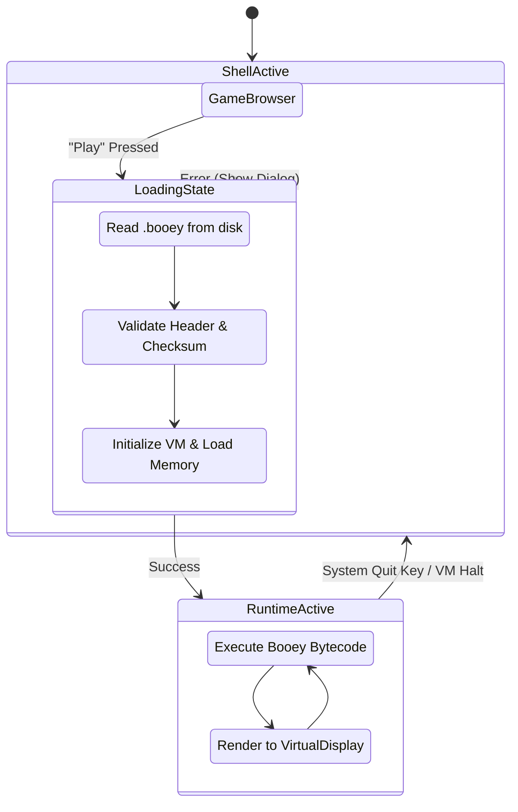

# Ooey-Station: Boot Loader & Game Browser

## 1. Boot Sequence

The Ooey-Station startup experience is designed to emulate the feel of a retro console booting up, complete with hardware checks and a splash screen.

### Stage 1: BIOS / Splash Screen (1-2 seconds)
- The application starts with a completely black screen.
- The Ooey-Station logo fades in or scales in with a brief animation.
- A "Memory Check" style text scrolls by rapidly at the bottom of the screen (e.g., `RAM: 64KB OK... VRAM: 32KB OK...`).
- *Future*: A characteristic boot jingle will play.

### Stage 2: System Check & Game Discovery
- The system scans the `games/` directory for available games.
- It parses the `game.txt` metadata file for each discovered game directory.
- A brief status message (e.g., `Loading Game Library... X games found`) is displayed.
- The system then transitions to the Game Browser interface.

---

## 2. Game Directory Structure

The Ooey-Station uses a simple, directory-based approach for managing the game library. All games reside in the `games/` directory relative to the executable (or a configured path).

```
games/
├── frogger_clone/
│   ├── game.txt          # Metadata file (Title, Author, etc.)
│   └── game.booey        # Compiled game binary
├── space_invaders/
│   ├── game.txt
│   └── game.booey
└── platformer_demo/
    ├── game.txt
    └── game.booey
```

Each game **must** be contained within its own subdirectory and must contain at least a compiled `.booey` binary. The `game.txt` metadata file is optional but highly recommended.

---

## 3. Game Metadata File Format (`game.txt`)

The `game.txt` file uses a simple `key=value` format. It provides the Game Browser with the necessary information to display the game in the UI without having to parse or load the compiled binary.

### Example `game.txt`
```text
# Ooey-Station Game Metadata
title=Frogger Clone
author=LLM GameDev
version=1.0
description=Guide the frog across busy roads and rivers! Avoid cars and alligators to reach the lily pads safely.
genre=Arcade
release_date=2026-06-01
icon_colors=0x00FF00,0x004400,0x88FF88
palette_preview=forest
min_vm_version=1.0
```

### Parsing Rules
- One `key=value` pair per line.
- Lines starting with `#` are treated as comments and ignored.
- **Required fields**: None strictly required, but `title` and `description` will default to the directory name and "No description" if missing.
- **Unknown keys** are ignored to ensure forward compatibility.

---

## 4. `GameInfo` Struct

When the `GameScanner` parses the directories and metadata files, it populates a list of `GameInfo` structs.

```cpp
#pragma once

#include <string>
#include <vector>
#include <ooey/types.hpp>

namespace ooey_station {

struct GameInfo {
    std::string title;
    std::string author;
    std::string version;
    std::string description;
    std::string genre;
    std::string release_date;
    
    // Extracted from hex strings in game.txt
    std::vector<ooey::Color> icon_colors; 
    
    std::string palette_preview;
    
    // System paths
    std::string directory_path;
    std::string binary_path;
    
    // True if a valid .booey file was found in the directory
    bool is_valid{false}; 
};

} // namespace ooey_station
```

---

## 5. Game Browser UI

The Game Browser is built using the high-level **GOOEY** widget framework (`ooey::gooey`). It provides a polished, interactive interface for selecting games.

### UI Layout

```text
┌─────────────────────────────────────────────────────────────┐
│  ╔═══════════════════════════════════════════════════════╗  │
│  ║                   OOEY-STATION                        ║  │
│  ╚═══════════════════════════════════════════════════════╝  │
│                                                             │
│  ┌──────────────────┐ ┌──────────────────────────────────┐  │
│  │ Game 1           │ │ Title: Frogger Clone             │  │
│  │ ▶ Game 2         │ │ Author: LLM GameDev              │  │
│  │ Game 3           │ │ Genre: Arcade                    │  │
│  │ Game 4           │ │                                  │  │
│  │ Game 5           │ │ Description:                     │  │
│  │ Game 6           │ │ Guide the frog across busy       │  │
│  │                  │ │ roads and rivers!                │  │
│  │                  │ │                                  │  │
│  │                  │ │          [  PLAY  ]              │  │
│  └──────────────────┘ └──────────────────────────────────┘  │
│                                                             │
│  [ Settings ]                                  [ About ]    │
└─────────────────────────────────────────────────────────────┘
```

- **Left Panel (ListControl)**: A scrollable list of discovered games. It supports keyboard/gamepad navigation (Up/Down).
- **Right Panel (Details View)**: Displays the `GameInfo` for the currently selected game in the list.
- **Action Button**: A prominent "Play" button (activatable via the 'A' button, 'Start', or 'Enter').

### Game Icon Generation
Because Ooey-Station games rely heavily on procedural asset generation, they do not typically ship with external image files (like PNGs) for icons.

Instead, the browser generates a simple, iconic thumbnail dynamically:
1. It reads the `icon_colors` field from `game.txt`.
2. It uses these colors to generate a procedural 32x32 pixel pattern (e.g., stripes, checkerboard, or a simple gradient).
3. If no colors are provided, a default fallback icon is generated.

---

## 6. Game Loading Process

When the user selects a game and presses "Play", the system transitions from the Shell to the VM Runtime.



1. **Read Binary**: The `GameLauncher` opens the `.booey` file.
2. **Validate**: Checks the magic number (`BOOE`), version compatibility, and calculates the checksum to ensure file integrity.
3. **Initialize VM**: 
   - Clears the VM memory (RAM, VRAM, Audio RAM).
   - Loads the bytecode into the appropriate memory segment.
   - Resets the Program Counter (PC) and registers.
4. **Transition**: The main Application view switches from the `GameBrowser` widget to the `VirtualDisplay` rendering view.
5. **Execute**: The VM execution loop starts.

---

## 7. Returning to Browser

The user can exit a running game and return to the Game Browser at any time:
- **Input**: Pressing a dedicated system combination (e.g., `Select` + `Start` simultaneously) or a dedicated exit key (e.g., `Esc`).
- **VM Action**: The `EXIT` opcode is executed (if the game chooses to quit itself).

Upon exiting:
1. The VM execution halts.
2. Audio channels are immediately silenced.
3. The VM state (memory, registers) is discarded.
4. The Application view switches back to the `GameBrowser` widget.

---

## 8. Implementation Classes

### `BootLoader`
Manages the application startup state machine (Splash Screen -> Scanning -> Browser).

### `GameScanner`
Utility class that handles directory traversal and parsing of `game.txt` files to produce `std::vector<GameInfo>`.

### `GameBrowser`
An OOEY `View` composed of standard widgets (`ListControl`, `Label`, `Button`, `Column`, `Row`) that binds to a `GameBrowserViewModel` managing the selected game state.

### `GameLauncher`
Handles the transition logic. It takes a `GameInfo`, interacts with the file system to load the binary, and coordinates with the `BooeyVM` instance to begin execution.
