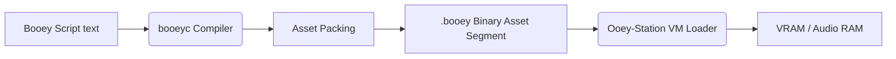

# Ooey-Station: Asset System (Sprites, Tilemaps, Sound)

Because Ooey-Station games are designed to be generated by LLMs and shared as single text files, external binary assets (like PNG images or WAV audio files) are not supported. Instead, all assets must be defined procedurally within the `.booey` script.

This document details how these text-based definitions are parsed, packed, and loaded by the VM.

---

## 1. The Asset Pipeline



When a game is compiled, the compiler parses the declarative blocks (`palette:`, `sprites:`, `sounds:`). It converts these into a highly compact binary format and appends them to the Asset Segment of the `.booey` executable. When the VM loads the game, it unpacks this segment directly into VRAM and Audio RAM.

---

## 2. Palette Definitions

The color palette is the foundation of the graphics system. Ooey-Station supports a 24-bit RGB space, but only 256 colors can be active at a time (indexed color).

### Syntax
```booey
palette:
    transparent: rgb(255, 0, 255)  # Index 0 is ALWAYS transparent
    black: rgb(0, 0, 0)
    white: rgb(255, 255, 255)
    red: rgb(255, 0, 0)
```

### Compiler Packing
The compiler assigns an index (0-255) to each defined color in the order they appear. The string names are used during compilation to map sprite pixels to these indices but are discarded in the final binary. The binary simply contains an array of `[R, G, B]` byte triplets.

---

## 3. Sprite Definitions (Pixel Art)

Sprites are defined using an ASCII-grid format. This format is intuitive for humans and easy for LLMs to generate.

### Syntax
```booey
sprites:
    player 16x16:
        . . . r r r r . . . . . . . . .
        . . r r r r r r . . . . . . . .
        . . . b w b w . . . . . . . . .
        # ... (16 lines total)
```

### Mapping Rules
1. **Dimensions**: The header `player 16x16` defines the width and height.
2. **Transparency**: A period `.` or a space ` ` maps to palette index 0 (transparent).
3. **Color Mapping**: Letters map to colors defined in the `palette` block. The compiler looks at the *first letter* of the color name. (e.g., `r` matches `red`). If multiple colors start with the same letter, case sensitivity is used, or the compiler throws an ambiguous mapping error.

### Compiler Packing
A sprite is packed into VRAM as a linear array of 8-bit palette indices. A 16x16 sprite consumes exactly 256 bytes of VRAM.
The binary format includes a header for each sprite: `[SpriteID (2 bytes)] [Width (1 byte)] [Height (1 byte)] [Pixel Data]`.

---

## 4. Tilemap Definitions

Tilemaps define the static backgrounds of a level. They consist of a set of unique 8x8 or 16x16 tiles, and a layout matrix that references those tiles.

### Tile Definition Syntax
Tiles are defined exactly like sprites but under the `tiles:` block.
```booey
tiles:
    brick 8x8:
        b b b b b b b b
        b w w w w w w b
        b w b b b b w b
        # ...
```

### Map Layout Syntax
Levels are defined by referencing the defined tiles. To save typing (and context tokens for LLMs), run-length encoding (RLE) style syntax is supported.

```booey
level 1:
    layer 0:
        # A row of 40 brick tiles
        row: brick * 40
        
        # A mixed row
        row: brick * 2, air * 36, brick * 2
```

### Compiler Packing
The unique pixel data for each tile is packed into VRAM. The layout matrices are packed as 2D arrays of `TileID` integers (typically 2 bytes per ID) and loaded into a separate region of VRAM.

---

## 5. Sound Effect Definitions

Sound effects are procedurally generated using basic synthesis parameters rather than PCM wave data.

### Syntax
```booey
sounds:
    jump:
        type: sweep
        start_freq: 200
        end_freq: 800
        duration_ms: 150
        wave: square
        volume: 80

    explosion:
        type: noise
        duration_ms: 300
        decay: fast
```

### Synthesis Types
1. **Tone**: A simple constant frequency.
2. **Sweep**: Frequency slides from `start_freq` to `end_freq`.
3. **Noise**: White or periodic noise (good for impacts/explosions).
4. **Arpeggio**: Rapidly cycles through a sequence of notes.

### Compiler Packing
Sound definitions are extremely compact. Each sound is compiled into a ~16-byte struct containing its parameters (type enum, frequencies, duration, wave type) and stored in Audio RAM. When the VM executes a `SFX` opcode, the Audio Engine reads these parameters and configures a synthesis channel to play it.
